# ERPtask
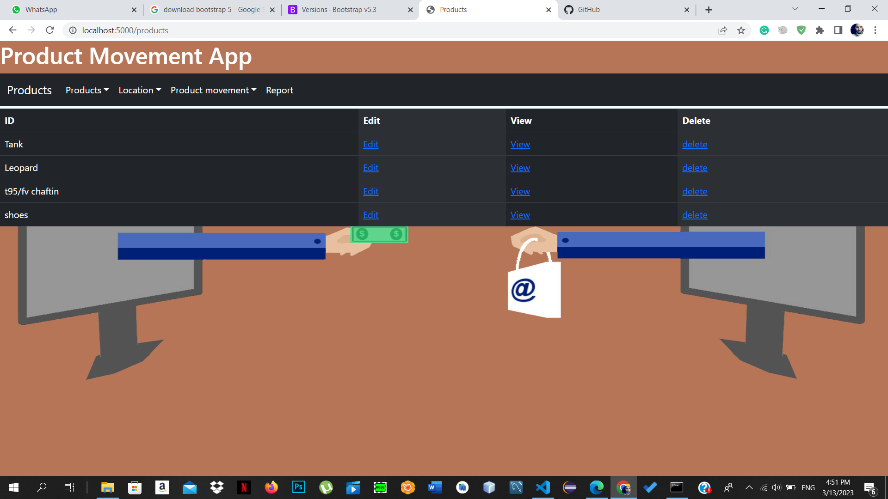
here show a list of products we have with their Ids

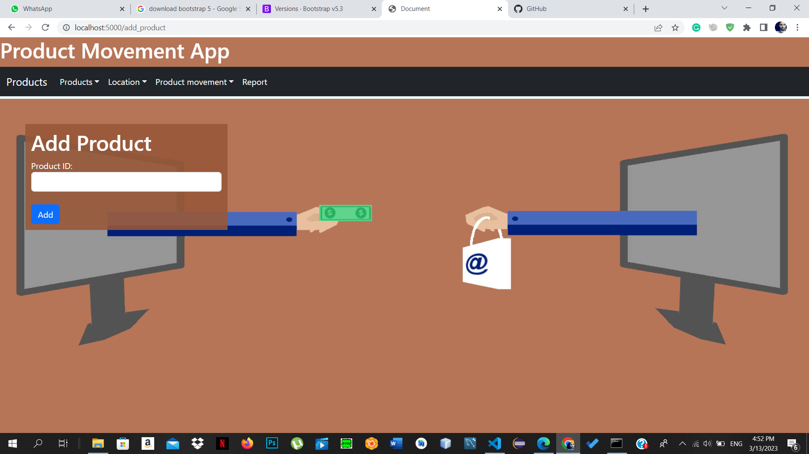
from this form we can add a new product
------------------

***note: validate*** 

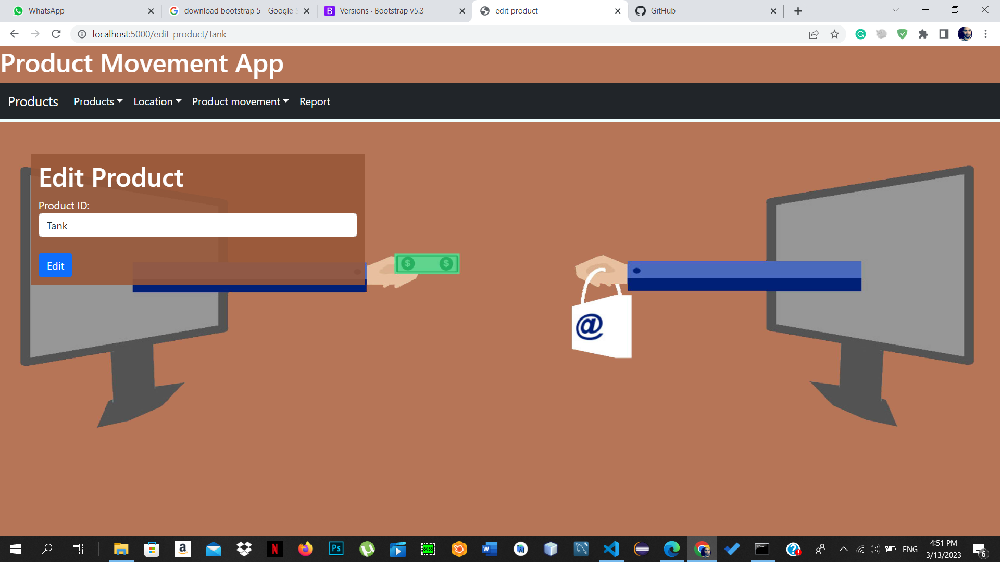

here we can edit product proprties
------------------
note: validate 

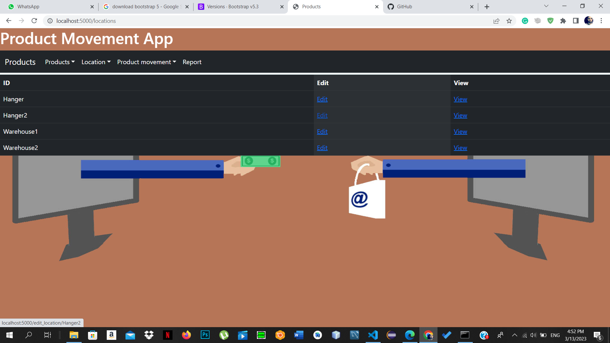
here a list of locations (Warehouses)

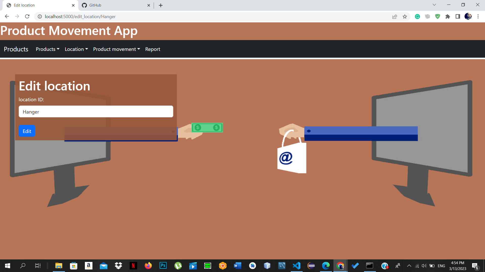
here we can edit the location 
------------------
note: validate 

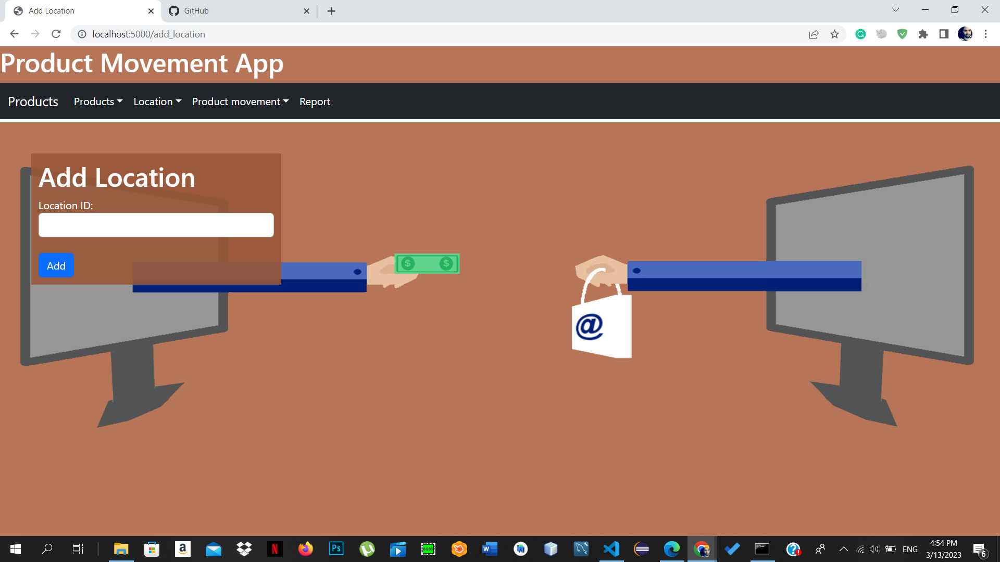
in this form we can adda new location (Warehouse)
------------------
note: validate 

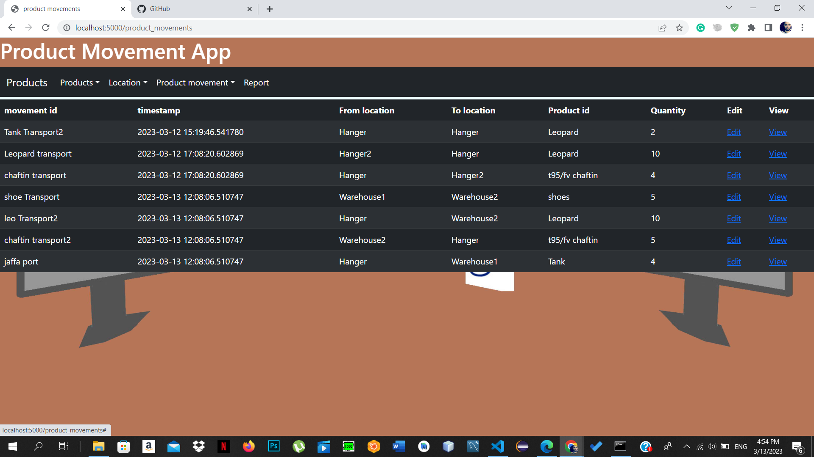
here's some movements i did it's showing the the id,time,location and product
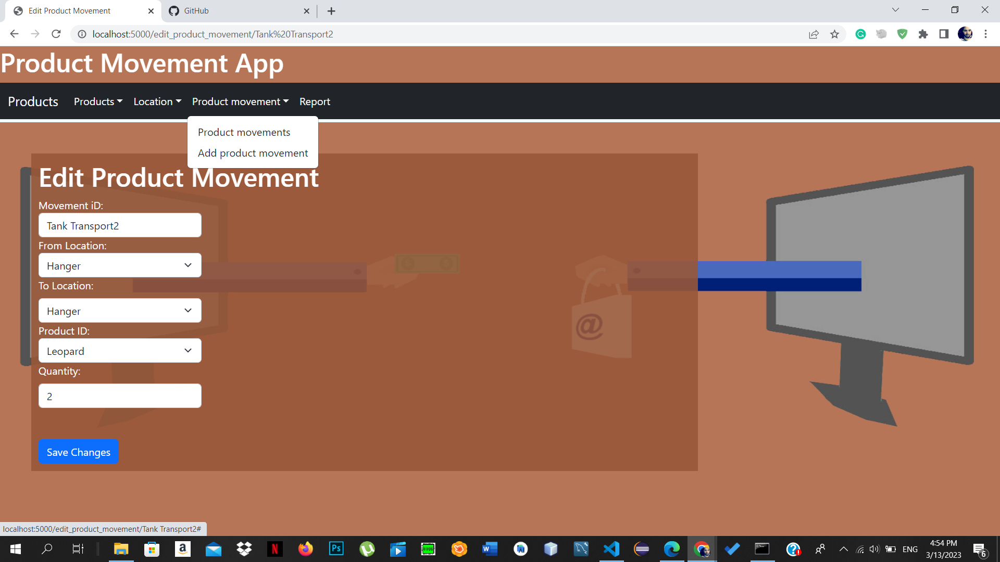
here we can edit the movemnt 
------------------
note: validate 
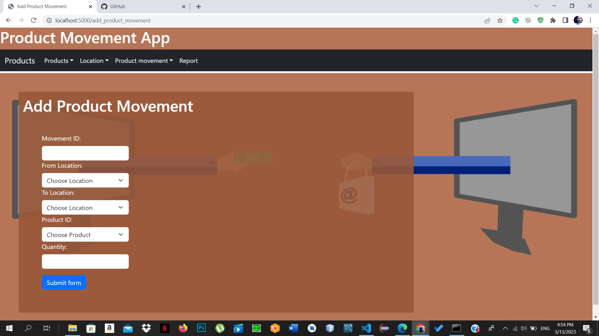
here we can do a new movment 
------------------
note: validate 

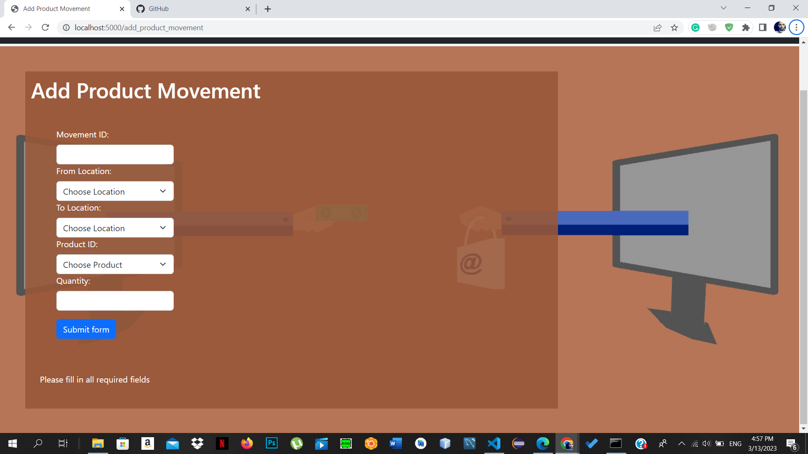
**validation example**

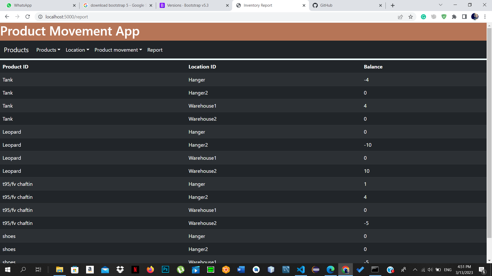
***finallay*** : this page shows the report of all movemnts made

